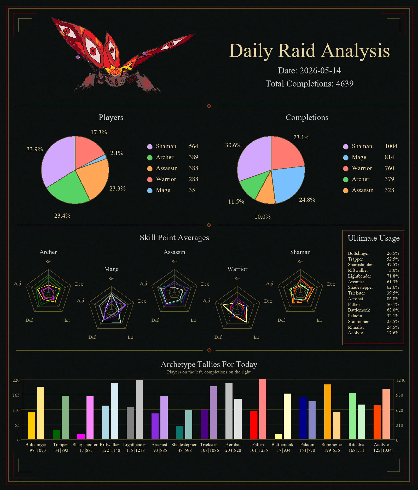

# Wynn Analytics

A large-scale Wynncraft raid analytics pipeline focused on tracking raid participation, archetype trends, skill point distributions, and long-term gameplay patterns.

The project continuously polls Wynncraft player data, computes hourly raid deltas, stores historical snapshots in BigQuery, and generates automated visual daily reports delivered directly to Discord.

---

# Features

## Hourly Raid Tracking

The tracker continuously:

* Polls online player data from the Wynncraft API
* Detects raid completion deltas
* Tracks per-character raid activity
* Preserves historical raid progression over time

---

## Archetype Analytics

The pipeline records:

* Archetype usage
* Unique player counts
* Completion totals
* Average skill point distributions
* Completion-adjusted participation

---

## Ultimate Usage Tracking

Daily analysis also tracks archetype ultimate usage rates by:

* Fetching ability trees
* Detecting equipped ultimates
* Aggregating per-archetype ultimate adoption

Players with hidden character data are automatically excluded from ultimate lookups.

---

## Automated Daily Reports

Every day the system:

* Aggregates the previous day's raid activity
* Generates stylized dashboard images
* Uploads summaries directly to Discord
* Stores historical digest rows in BigQuery

The dashboard includes:

* Class participation pie charts
* Archetype completion comparisons
* Skill point radar charts
* Ultimate usage panels
* Historical trend visualizations

---

# Architecture

```text
Wynncraft API
    ↓
Hourly Scraper
    ↓
Delta Computation
    ↓
SQLite State Cache
    ↓
BigQuery Historical Storage
    ↓
Daily Aggregation
    ↓
Pillow Dashboard Rendering
    ↓
Discord Reporting
```

---

# Tech Stack

## Backend

* Python
* asyncio
* aiohttp

## Storage

* BigQuery
* SQLite

## Reporting

* Pillow
* Discord Webhooks

## Infrastructure

* Google Cloud VM
* systemd

---

# Data Stored

## Hourly Raid Data

The system stores:

* Player ID
* Character ID
* Archetype
* Skill points
* Timestamp
* Per-raid completion deltas

## Daily Digest Data

Daily summaries include:

* Raid
* Archetype
* Unique players
* Total completions
* Average skill points
* Ultimate usage counts

---

# Discord Reporting

The project supports:

* Automatic daily report posting
* Existing forum-thread integration
* Multi-image dashboard uploads
* Scheduled digest generation

## Example Daily Dashboard



Artwork assets created by @.dwagonic
---

# Configuration

Example environment variables:

```env
DISCORD_WEBHOOK_URL=
BQ_PROJECT_ID=
BQ_DATASET=
BQ_HOURLY_TABLE=
BQ_DAILY_TABLE=
REPORT_OUTPUT_DIR=data/reports
DISCORD_WEBHOOK_URL=
DAILY_DIGEST_HOUR_UTC=17
DAILY_DIGEST_MINUTE_UTC=30
```

---

# Running Locally

## Install Dependencies

```bash
pip install -r requirements.txt
```

## Run Main Scraper

```bash
python -m src.main
```

## Run Daily Digest Test

```bash
python -m src.Scripts.test_daily_digest
```

---

# Deployment

The production deployment runs on a Google Cloud VM using systemd.

Typical deploy flow:

```bash
sudo systemctl stop wynn-analytics
cd ~/wynn-analytics
git pull
source .venv/bin/activate
pip install -r requirements.txt
sudo systemctl start wynn-analytics
```

---

# Current Focus

Current development priorities include:

* Improved dashboard rendering
* Historical trend analysis
* Player-level fallback raid tracking
* Ability tree caching
* Query and API call optimization

---
